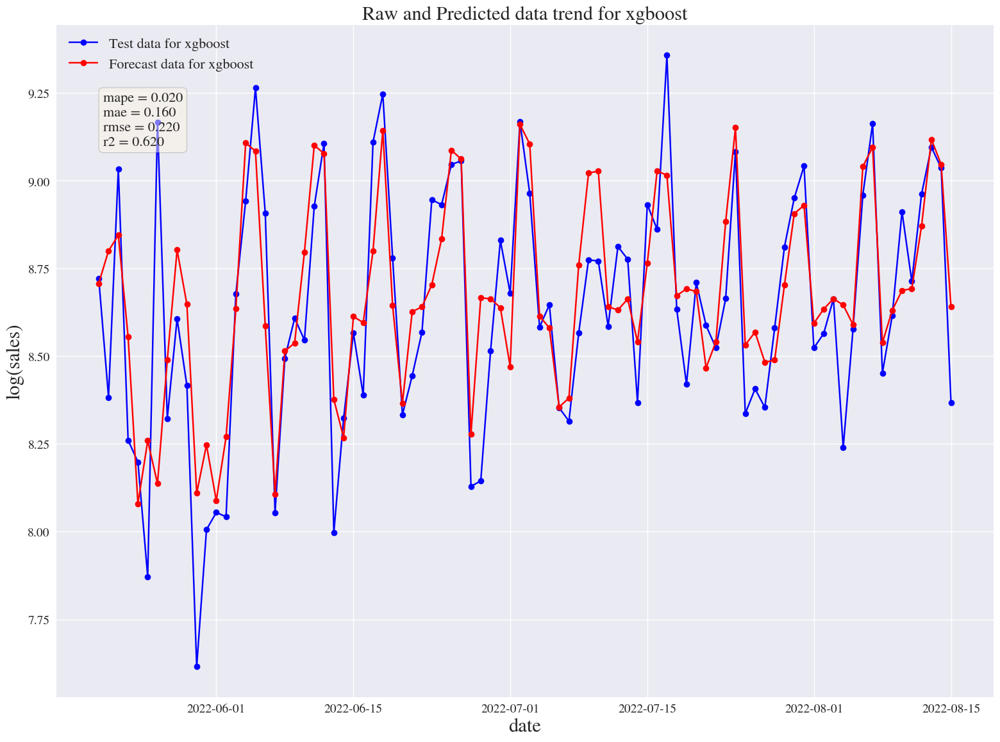
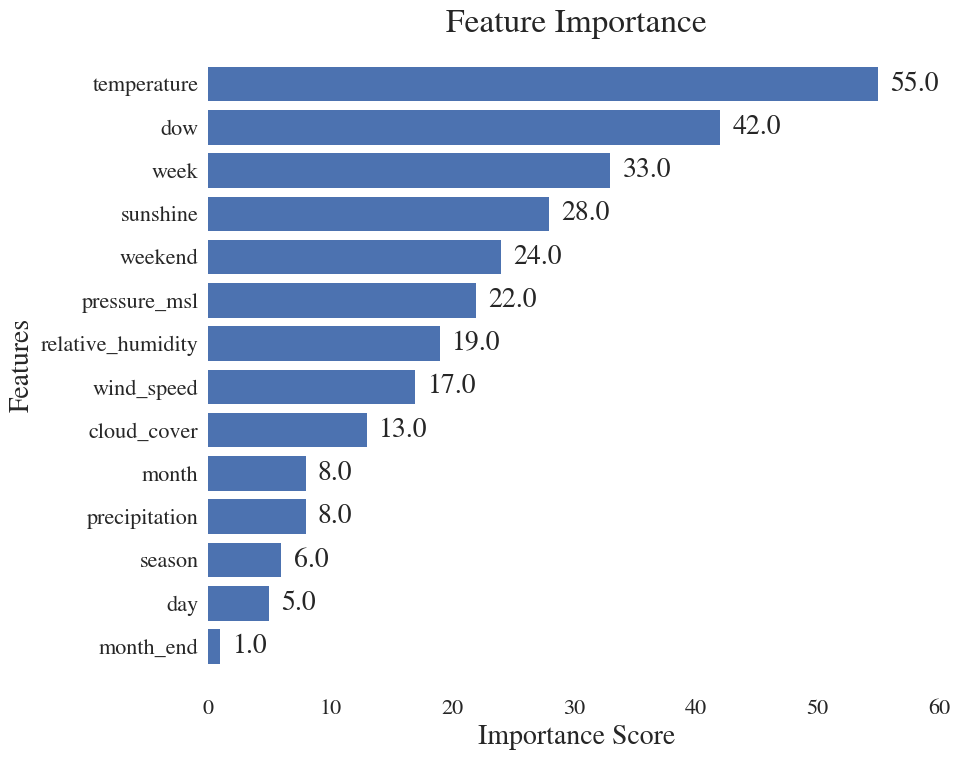
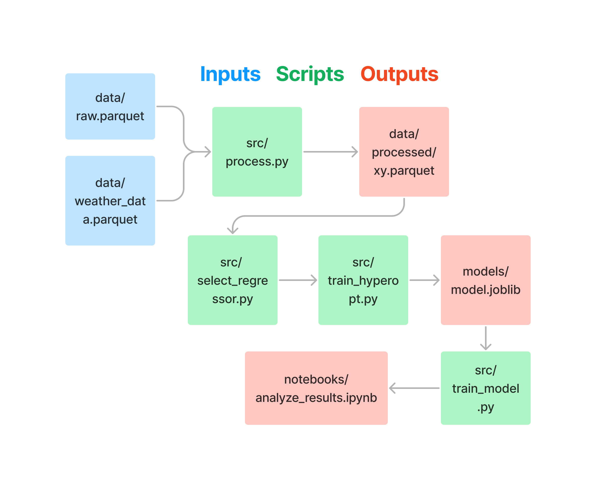
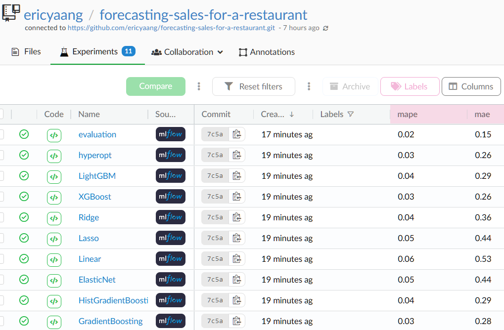

# Machine Learning-Based Sales Prediction for a Top-Rated Steakhouse


This project is a Proof of Concept (PoC) prototype that aims to help a restaurant manager scale the number of employees needed to meet the establishment's daily demand.

Our aim is to forecast daily log sales for the next 7 days using the historical sales data. 

Accurately predicting future log sales can optimize employee scheduling, managing labor costs, and improve overall efficiency and profitability. By using a reliable model, we can anticipate changes in demand, adjust staffing levels accordingly, and provide excellent service to our customers.

The Extreme Gradient Boosting (XGBoost) algorithm was chosen for predicting future sales due to its superior overall performance and faster processing time. It also requires less effort in feature engineering.

**Metrics**:

We are using MAPE as the main metric to evaluate our time series forecasting model. Other metrics will be used for comparison and to supplement our analysis.

- **MAPE (Mean Absolute Percentage Error)**
- MAE (Mean Absolute Error) 
- RMSE (Root Mean Squared Error)
- R2 (Coefficient of Determination)


**Data:** The app only requires the total value of daily sales and mean daily temperature, as follows in this example:

date | sales | temp |
--- | --- | --- |
2021-06-01 | 3540.91 | 15.1 |
2021-06-02 | 5049.35 | 21.0 |
2021-06-03 | 7655.55 | 23.3|
2021-06-04 | 5885.45 | 16.9|


The ideal minimum period would be 1 year, in order to observe the annual seasonality that encompasses the complete cycle of seasons, as temperature varies depending on the season.

## Results

Out of the 441 samples, 353 (80%) were separated for the training set and 88 (20%) for the testing set.

For our experiment, we used 5-fold cross-validation with a gap of 7 days to avoid overfitting.

**The experimental results of our XGBoost model compared to others**

We can easily observe that our model has the superior performance over the traditional machine learning models.


 Models               |   Duration(s) |   MAPE |   MAE |   RMSE |     R2 |
|:----------------|--------------:|-------:|-----:|-------:|-------:|
| **XGBoost**          |       **1.5** |**0.03** |  **0.26** |   **0.33** |   **0.39** |
| GradientBoosting     |           1.7 |   0.03 |  0.28 |   0.35 |   0.32 |
| LightGBM             |           1.5 |   0.04 |  0.29 |   0.37 |   0.23 |
| Ridge                |           1.4 |   0.04 |  0.36 |   0.56 |  -1.19 |
| HistGradientBoosting |           3.2 |   0.04 |  0.29 |   0.37 |   0.23 |
| Random Forest        |           2.2 |   0.04 |  0.31 |   0.38 |   0.2  |
| Lasso                |           1.5 |   0.05 |  0.44 |   0.55 |  -0.63 |
| ElasticNet           |           1.3 |   0.05 |  0.44 |   0.55 |  -0.62 |
| Linear               |           1.4 |   0.06 |  0.53 |   1.53 | -31.13 |

### Final evaluation


Our model's MAPE is 0.02, indicating that its predictions are within 2% of the actual values. With an accuracy rate of 98%, the model is reliable and useful for predicting future values of the time series for this context. However, it is important to exercise caution as our sample size is small and more data would be needed to increase our confidence in the model's accuracy.

We identified a high outlier in the standardized residuals on May 26th, 2022, which caused deviation from the normal distribution. Therefore, further investigation is needed.

To delve deeper into the error analysis, you may execute the `notebooks\analyze_results.ipynb` notebook, where we conduct a thorough examination of errors.




### Limitations
At present, we use log sales as an estimate for daily demand to inform our employee scheduling decisions. While this approach may not capture the full complexity of daily demand patterns, it still provides a useful approximation.

However, in the future, we plan to incorporate more detailed information, such as hourly data and advanced feature engineering, to make even more accurate predictions. This will allow us to optimize our employee scheduling to meet the needs of our customers at different times of the day, reducing wait times, improving service quality, and minimizing labor costs.


## Tools used
- [Poetry](https://python-poetry.org/): packaging and dependency management
- [MLflow](https://mlflow.org/): experiment tracking
- [DagsHub](https://dagshub.com): managing and tracking machine learning workflows
- [Hydra](https://hydra.cc/): simplifying the configuration of complex applications


## Project structure

- `src`:  contains the source code of the project, usually written in Python scripts
- `config`: contains configuration files for the project, which can include settings for data sources, model parameters, and other variables
- `data`: contains the data used in the project, which may be organized into subdirectories for different datasets or versions
- `notebook`: contains Jupyter Notebooks used for reporting results
- `tests`: contains test files to ensure the code is functioning as intended
- `models`: stores the fitted models

## Set Up the Project

#### Clone this repository


```bash
git clone https://github.com/ericyaang/forecasting-sales-for-a-restaurant
```

#### Install

```bash
make install_all
```
#### Set your credentials

On `config\main.yaml` paste your credentials from DagsHub repository to your track metrics with mlflow

See more in [documentation](https://dagshub.com/docs/integration_guide/mlflow_tracking/index.html)

```yaml

mlflow:
  uri: MLFLOW_TRACKING_URI
  username: MLFLOW_TRACKING_USERNAME
  password: MLFLOW_TRACKING_PASSWORD
  experiment_name: XGBoost Baseline

```


####  Run the Project

```bash
make pipeline
```
### Machine learning pipeline

Scripts:

* `src/process.py`: contains code for preprocessing the data.
* `src/select_regressor.py`: contains code for selecting the appropriate regressor for the model.
* `src/train_hyperopt.py`: contains code for training the model using hyperopt and cross-validation to find the optimal hyperparameters.
* `src/train_model.py`: contains code for training the final model and saving it as an object.




Once the pipeline run is completed, you can access to MLflow's server in your DagsHub repository like this:


